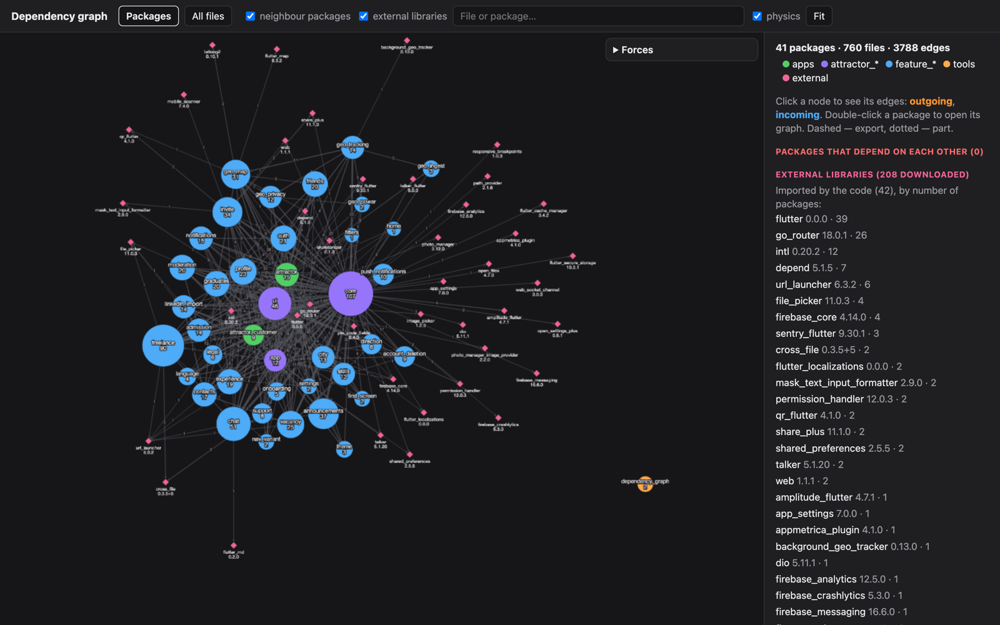
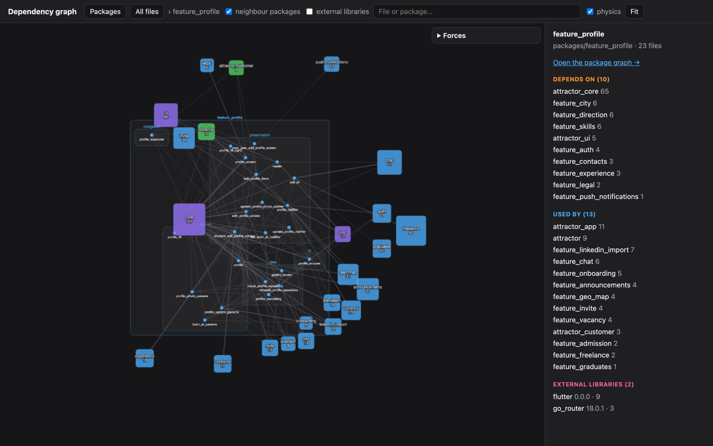
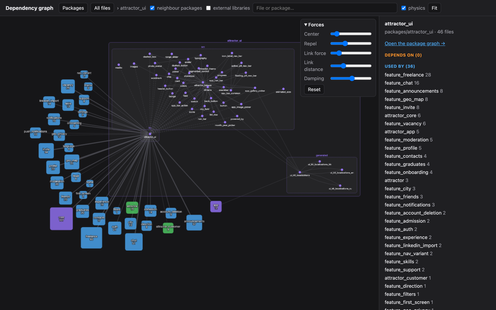

# 🕸️ Dependency Graph

<div align="center">
  <a href="https://pub.dev/packages/dependency_graph">
    
  </a>
  <a href="https://pub.dev/packages/dependency_graph">
    
  </a>
  <a href="https://pub.dev/packages/dependency_graph/score">
    
  </a>
  <a href="https://pub.dev/packages/dependency_graph">
    
  </a>
  <a href="https://github.com/AlexHCJP/dependency_graph">
    
  </a>
  <a href="https://github.com/AlexHCJP/dependency_graph">
    
  </a>
  <a href="https://github.com/AlexHCJP/dependency_graph/graphs/contributors">
    
  </a>
  <a href="https://github.com/AlexHCJP/dependency_graph/issues">
    
  </a>
  <a href="https://github.com/AlexHCJP/dependency_graph">
    
  </a>
  <a href="https://github.com/AlexHCJP/dependency_graph/blob/HEAD/LICENSE">
    
  </a>
  <a href="https://pub.dev/packages/dependency_graph">
    
  </a>
</div>

A Dart command-line tool that shows who imports whom in a Dart package or a [pub workspace](https://dart.dev/tools/pub/workspaces) — and which pub libraries it pulls in — as one interactive HTML page.



## 📋 Features

- 📦 Packages graph — one node per package, edges weighted by the number of directives
- 🔍 Package graph — its files boxed by folder, every neighbour package as one node
- 🗂️ All files graph — every file, boxed by package and folder
- 🌐 External libraries — every library `pubspec.lock` downloaded, with its version and who imports it
- 🔴 Packages that depend on each other are marked red
- 🧲 Live physics, Obsidian-style — drag a node and its neighbours follow
- 🎛️ Adjustable forces — center, repel, link force, link distance, damping
- 🌗 Light and dark theme, following the system

## 🚀 Installation

### In a project (as dev dependency)

```shell
dart pub add -d dependency_graph
```

Or manually in `pubspec.yaml`:

```yaml
dev_dependencies:
  dependency_graph: ^0.1.0
```

### Globally

```shell
dart pub global activate dependency_graph
```

Then run as:

```shell
dependency_graph [root] [out.html]
```

## 📖 Usage

```bash
dart run dependency_graph [root] [out.html]
```

### Arguments

| Argument | Description | Default |
|----------|-------------|---------|
| `root` | The package or workspace root | `.` |
| `out.html` | Where to write the page | `<root>/build/dependency_graph/index.html` |
| `-h, --help` | Print usage information | |

Run `dart pub get` first, so `pubspec.lock` lists the external libraries. The page loads Cytoscape.js and d3 from a CDN, so it needs a network connection to open.

## 🎯 Views

### Packages

One node per package, sized by its file count. Packages are coloured by the folder they sit in (`apps`, `packages`), split by a name prefix several packages share (`feature_*`). Tick **external libraries** to add the pub packages the code imports.

**What it shows:**
- 📊 How many directives go from one package to another
- 🔴 Packages that import each other
- 🌐 Every downloaded library, and the ones the code actually imports

### Package

Double-click a package to open it: its files boxed by folder, and each package it touches as one node.



**What it shows:**
- ➡️ What the package depends on, and how much
- ⬅️ Who uses it
- 🌐 Which external libraries it imports

Click any node to highlight its edges: **outgoing** in orange, **incoming** in blue. Dashed edges are `export`, dotted are `part`.

### Forces

Open the **Forces** panel to tune the physics. The settings are kept in the browser; **Reset** brings back the defaults.



| Slider | Effect |
|--------|--------|
| Center | Pull towards the middle |
| Repel | How hard nodes push each other away |
| Link force | Stiffness of the edges — lower is softer |
| Link distance | Length of the edges |
| Damping | How fast the motion settles |

Views above 600 nodes keep still; untick and tick **physics** to run it there anyway.

## 💡 As a library

```dart
import 'dart:io';

import 'package:dependency_graph/dependency_graph.dart';

void main() {
  final graph = scan(Directory('.'));
  File('graph.html').writeAsStringSync(render(graph));
}
```

`scan` returns plain data — `packages`, `files`, `edges`, `external`, `uses` — if you'd rather feed it to something else.
